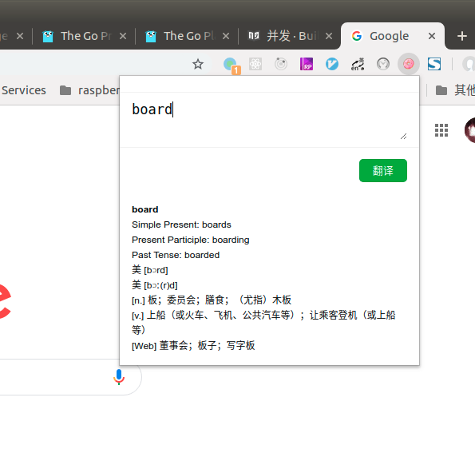
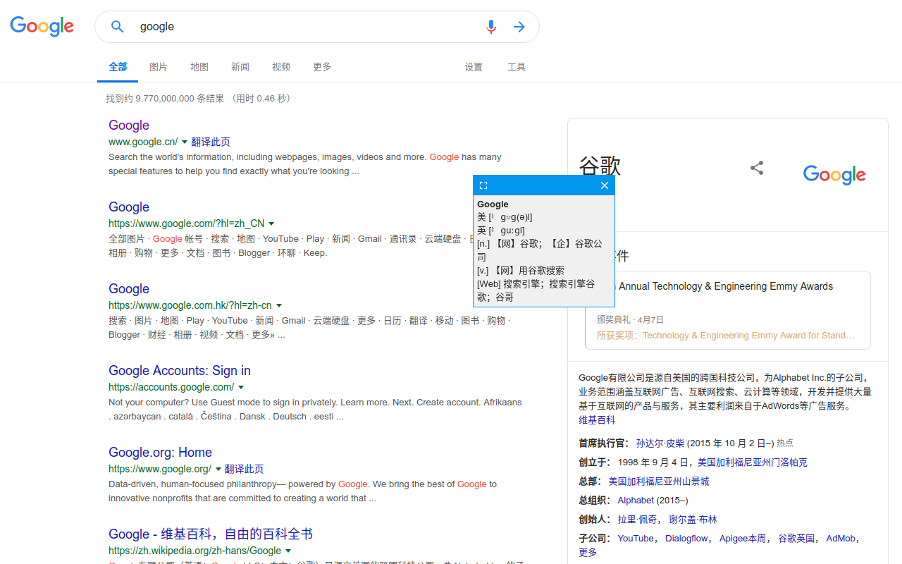
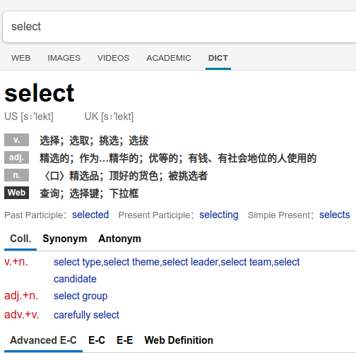
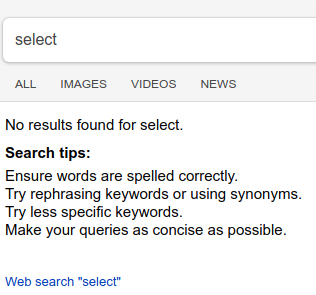

# mihuan-translate

> 人生太艰难了，本来简单做个翻译工具，安安静静用就算了。
> 但天有不测风云，详见下面[一些记录](#其二)

一个给自己用的谷歌浏览器翻译扩展

- 如果是英文单词，使用bing词典翻译
- 如果是英文段落，使用谷歌翻译成中文
- 如果是中文，使用谷歌翻译成英文

## 一些记录

### 其一

2019年5月发现不能使用，开始以为服务器什么问题，
最终定位到问题，原来是谷歌浏览器同源政策改变引起的。
跨域请求即使写到`permissions`名单了也不行。

- [Changes to Cross-Origin Requests in Chrome Extension Content Scripts](https://www.chromium.org/Home/chromium-security/extension-content-script-fetches)
- [What is new in Chrome with the context of Chrome Extensions?](https://medium.com/aviabird/handling-cross-origin-fetches-in-chrome-extensions-for-chrome-73-98a094052b7f)

解决办法是把网络请求从`content_scripts`写到`background`脚本里面。
然后两个脚本间用`chrome.runtime`的事件来通信，生生把一个脚本解决的事情弄成两个脚本。

### 其二

2019年7月又不能使用了，确切的说查询新的英文单词出错，
曾查过的词（`mongodb`里面有缓存）是没问题的，新查的词不行。

开始以为是`bing`的网站更改了页面结构，导致解析失败。
可是定位问题后，结果令人沮丧。

`bing`的页面结构没有变化，我的代码也没有变化，
本地调试没有任何问题，服务器运行就不行。

最大可能是：`bing`对爬虫做了一些限制，可能是针对header，ip，或其他。

正常访问的页面：

实际访问得到的页面：

这个问题就有点棘手了，有时间再解决吧：

- 方案一：使用更完备的`Request Headers`躲过限制（希望可以）
- 方案二：改用使用`Headless Chrome`试试（可能对查询速度有影响）
- 方案三：换服务器试试（下策）
